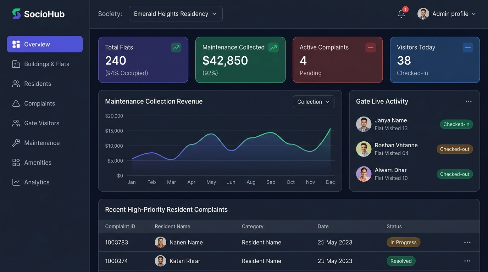

# SocioHub — Smart Society & Apartment Management Platform



**SocioHub** is a full-stack, multi-tenant residential society management platform designed to streamline community operations, gated physical security, resident engagement, maintenance collections, and administrative governance.

Built with **React 19, Vite, Tailwind CSS, TanStack Query, Zustand, Node.js, Express, MongoDB (Mongoose), and Socket.IO**.

---

## 🌟 Key Features

### 🏢 Society Administration & Governance
* **Tower & Flat Registry**: Multi-wing management, flat types, floor plans, and occupancy states (`OWNER_OCCUPIED`, `TENANT_OCCUPIED`, `VACANT`).
* **Residents Directory & Approvals**: Public self-registration requires explicit admin verification before accounts are activated.
* **Staff & Security Personnel Management**: Provision security guard and co-admin accounts, toggle status, and reset credentials.
* **Password Reset Verification Queue**: Users requesting password resets via the login screen are queued for Admin approval before changes take effect.
* **Notice Board**: High-priority broadcasts with expiration schedules, pinned notices, and real-time socket delivery.
* **Helpdesk & Service Desk**: Resident complaint tracking with category tags, severity badges, and status progression.
* **Maintenance & Cash Desk**: Collection tracking, cash verification desk, and dynamic UPI QR code generator for direct UPI transfers.

### 🛡️ Gatekeeper Terminal (Security Portal)
* **Live Resident Radar**: Real-time arrival requests dispatched directly to residents.
* **QR Visitor Pass Scanner**: Quick verification of resident-generated guest passes.
* **Walk-in Entry Logging**: Fast entry registration with delivery/cab/guest categorization.
* **Approval Isolation**: Resident approval requests are restricted to residents only, keeping the gatekeeper focused on queue management.

### 🏠 Resident Portal
* **Personalized Dashboard**: Wing, flat, tenancy status, maintenance due dates, and quick actions.
* **Digital Guest Passes**: Generate pre-approved QR entry passes for friends, delivery agents, and maintenance staff.
* **Instant Arrival Popups & Sound**: Real-time alerts when visitors arrive at the main security gate.
* **Maintenance UPI Payment**: Scan dynamic UPI QR codes mapped to the society's UPI ID.
* **Service Tickets**: Submit maintenance issues directly to society administration.

---

## 🛠️ Technology Stack

| Layer | Technologies |
|---|---|
| **Frontend** | React 19, Vite, Tailwind CSS, Lucide Icons, TanStack Query, Zustand, Axios, QRCode.react |
| **Backend** | Node.js (ES Modules), Express.js, Socket.IO, JWT, bcryptjs |
| **Database** | MongoDB with Mongoose ODM |
| **Real-time** | WebSockets via Socket.IO (society-wide and resident-specific rooms) |

---

## 📁 Repository Structure

```text
├── client/                     # React Frontend Web Application (Vite)
│   ├── src/
│   │   ├── api/                # Axios instance & interceptors
│   │   ├── components/         # Reusable UI, modals, shell, and layout
│   │   ├── context/            # AuthContext & SocketContext
│   │   ├── pages/
│   │   │   ├── admin/          # Admin Dashboard, Wings, Residents, Billing, Staff, Notices
│   │   │   ├── resident/       # Resident Dashboard, Visitors, Helpdesk, Notices
│   │   │   ├── security/       # Gatekeeper Terminal, Live Radar, Visitor Logs
│   │   │   └── auth/           # Login, Register, Forgot Password Modal
│   │   └── styles/             # Tailwind & Glassmorphism styles
│   ├── package.json
│   └── vite.config.js
│
├── server/                     # Node.js Express REST API & WebSockets
│   ├── src/
│   │   ├── config/             # MongoDB connection & environment loader
│   │   ├── controllers/        # Business logic for auth, users, flats, payments, visitors
│   │   ├── middleware/         # JWT verification, RBAC authorization, error handler
│   │   ├── models/             # Mongoose schemas (User, Flat, Building, Payment, Visitor, Notice, etc.)
│   │   ├── routes/             # Express API route declarations
│   │   ├── scripts/            # Database seed scripts (seedPhase1, seedPhase2)
│   │   └── server.js           # Server bootstrap & Socket.IO server
│   ├── .env.example
│   └── package.json
│
├── assets/                     # Platform design mockups and UI captures
└── README.md
```

---

## 🚀 Getting Started Locally

### Prerequisites
* **Node.js**: v18+ or v20+ recommended
* **MongoDB**: Running locally on `mongodb://127.0.0.1:27017` or a free cloud [MongoDB Atlas](https://www.mongodb.com/cloud/atlas) cluster.
* **Git**

### 1. Clone the Repository
```bash
git clone https://github.com/<your-username>/sociohub-society-management.git
cd sociohub-society-management
```

### 2. Configure Backend Environment
Create a `.env` file in the `server/` folder based on `.env.example`:
```env
PORT=5000
NODE_ENV=development
MONGO_URI=mongodb://127.0.0.1:27017/sociohub
JWT_SECRET=sociohub_jwt_super_secret_key_2026_modern_residency
JWT_EXPIRES_IN=7d
CLIENT_URL=http://localhost:5173
```

### 3. Install Dependencies & Seed Data
```bash
# In the server directory:
cd server
npm install
npm run seed:phase1     # Seeds society, buildings, flats, and initial accounts
npm run seed:phase2     # Seeds sample visitors, notices, and payments
npm run dev             # Starts API server on http://localhost:5000
```

### 4. Start the Frontend Application
```bash
# In a new terminal, from the client directory:
cd client
npm install
npm run dev             # Starts Vite React dev server on http://localhost:5173
```

---

## 🔑 Default Demo Accounts

| Role | Email | Password | Access Level |
|---|---|---|---|
| **Society Admin** | `admin@emeraldheights.com` | `admin123` | Full administrative control & approvals |
| **Resident Owner** | `piyush.resident@emeraldheights.com` | `resident123` | Flat A-101 owner portal, pass generation |
| **Resident Tenant**| `ananya.tenant@emeraldheights.com` | `resident123` | Flat A-102 tenant portal |
| **Security Guard** | `security@emeraldheights.com` | `security123` | Gatekeeper Terminal (Gate 1) |

---

## 🌐 Future Hosting & Deployment Guide

### Backend (Render / Railway / Fly.io)
1. Set the root directory to `server`.
2. Build Command: `npm install`.
3. Start Command: `node src/server.js`.
4. Add Environment Variables:
   * `MONGO_URI`: Your production MongoDB Atlas connection string.
   * `JWT_SECRET`: A long, randomly generated secret string.
   * `CLIENT_URL`: Your deployed frontend URL (e.g. `https://sociohub.vercel.app`).
   * `NODE_ENV`: `production`.

### Frontend (Vercel / Netlify)
1. Set the root directory to `client`.
2. Framework Preset: **Vite**.
3. Build Command: `npm run build`.
4. Output Directory: `dist`.
5. Environment Variable:
   * `VITE_API_URL`: Your deployed backend URL (e.g. `https://sociohub-api.onrender.com`).

---

## 📄 License
This project is open-source and available under the [MIT License](LICENSE).
