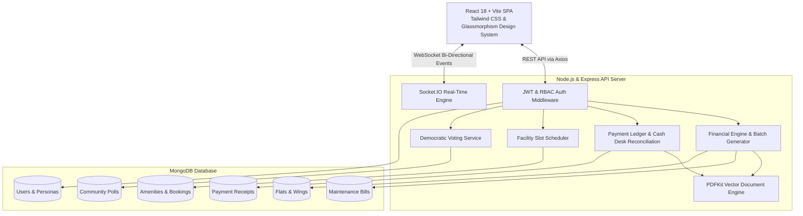

# 🏢 SocioHub — Smart Society & Apartment Management Platform

> An enterprise-grade, full-stack **MERN** (MongoDB, Express, React, Node.js) platform for modern gated residential societies and apartment complexes. SocioHub streamlines administrative operations, real-time security gate operations, community governance, and a complete financial billing engine with vector PDF invoicing.

---

## 📑 Table of Contents
- [Executive Summary & Elevator Pitch](#-executive-summary--elevator-pitch)
- [Key Features by Role](#-key-features-by-role)
- [System Architecture](#-system-architecture)
- [Tech Stack](#-tech-stack)
- [Data Modeling & Database Schema](#-data-modeling--database-schema)
- [Key Engineering Highlights (Interview Focus)](#-key-engineering-highlights-interview-focus)
- [How to Explain This Project in an Interview](#-how-to-explain-this-project-in-an-interview)
- [Live Demo Accounts](#-live-demo-accounts)
- [Getting Started Locally](#-getting-started-locally)
- [API Reference](#-api-reference)

---

## 🎯 Executive Summary & Elevator Pitch

> *"SocioHub is a multi-tenant residential management system designed to eliminate manual register books, fragmented WhatsApp announcements, and delayed maintenance collection in residential housing societies. Built on the MERN stack with Socket.IO for real-time duplex communication, it connects four key stakeholders: **Society Administrators**, **Resident Owners**, **Tenants**, and **Gate Security Guards**. It features a 1-click batch billing engine with empty-flat protection, dual-channel payment reconciliation (UPI & Cash Desk verification), server-side vector PDF generation, amenity slot booking, digital community voting polls, and visitor gate pass management."*

---

## 🚀 Key Features by Role

### 👑 1. Society Administrator Portal
- **Towers & Wings Management**: Multi-wing hierarchical structure (e.g., Wing A - Aster, Wing B - Bluebell) with floor-wise flat mapping.
- **Occupancy & Allocation Lifecycle**: Assign and unassign residents (Owners/Tenants) to flats with dynamic occupancy status (`VACANT`, `OWNER_OCCUPIED`, `TENANT_OCCUPIED`).
- **1-Click Batch Financial Billing Desk**:
  - Automatically calculate and generate monthly maintenance bills across all allotted flats.
  - **Vacant Flat Protection**: Automatically excludes unallotted/empty flats to avoid orphan, unpayable ledger dues.
  - Flexible billing scopes: Full Maintenance vs. Utility/Ad-hoc charges only.
- **Payment Reconciliation & Cash Desk**:
  - Instant online UPI transaction audit trail.
  - Physical cash desk verification workflow with admin sign-off.
- **Branded Vector PDF Engine**: On-the-fly downloadable PDF invoices and official numbered receipts.
- **Facility & Amenities Manager**: Create and manage amenities (Clubhouse, Olympic Pool, Tennis Courts) with slot duration and capacity rules.
- **Community Governance & Polls**: Create society-wide democratic voting polls with real-time tallying.
- **Notice Board & Announcements**: Issue high-priority pinned circulars with categories.
- **Staff & Guard Management**: Manage security personnel roster and gate access assignments.

### 🏠 2. Resident Portal (Owner & Tenant)
- **Financial Dues & One-Click Payment**: View active maintenance bills, breakdown of base rate vs. utilities, and pay online or initiate cash payment.
- **Digital Receipts & Invoice Archive**: Instant download of official GST/Society-stamped PDF invoices and payment receipts.
- **Facility Booking**: Real-time slot reservation system for community amenities with instant validation.
- **Democratic Voting**: Participate in society polls (e.g., EV Charging Station installations, festival budgets).
- **Visitor History & Gate Alerts**: View visitors who entered the society with timestamps and purpose.
- **Helpdesk & Maintenance Complaints**: Raise tickets (Plumbing, Electrical, Common Area) with priority flags and status tracking.

### 🛡️ 3. Security Guard Gate Terminal
- **Visitor Entry/Exit Logging**: Log delivery executives, cab services, guests, and maintenance technicians with flat numbers.
- **Real-Time Gate Pass Verification**: Instant status indicator for approved vs. pending visitor check-ins.
- **Emergency Contacts**: Quick access to tower secretaries and emergency society contacts.

---

## 🏗️ System Architecture



---

## 💻 Tech Stack

### Frontend
- **Library/Framework**: React 18 with Vite (Ultra-fast HMR and build optimization)
- **Routing**: React Router v6 with protected role-based layout wrappers
- **Styling**: Tailwind CSS + Custom Glassmorphism UI tokens, CSS variables, dark-mode first design
- **Icons**: Lucide React
- **HTTP Client**: Axios with centralized request/response interceptors for token injection & global error handling
- **Real-time Client**: Socket.IO Client

### Backend
- **Runtime**: Node.js (v20+)
- **Web Framework**: Express.js
- **Database**: MongoDB with Mongoose ODM
- **Real-Time**: Socket.IO for WebSocket events
- **PDF Engine**: PDFKit (server-side stream generation without headless browser overhead)
- **Authentication**: JSON Web Tokens (JWT) + HTTP-Only Cookie fallback + Bcrypt.js password hashing
- **Development Tooling**: Nodemon, Dotenv, Morgan

---

## 🗄️ Data Modeling & Database Schema

### Schema Highlights & Relational Integrity:
1. **Flats & Wings (`Flat.js`)**:
   - Compound Unique Index: `{ buildingId: 1, flatNumber: 1 }` ensures flat numbers cannot be duplicated within the same wing.
   - Dual-reference pointers: `ownerId` and `tenantId` linking directly to `User`.
   - Indexed `occupancyStatus` (`VACANT`, `OWNER_OCCUPIED`, `TENANT_OCCUPIED`).
2. **Maintenance Invoices (`Bill.js`)**:
   - Compound Unique Index: `{ flatId: 1, month: 1 }` prevents double-billing for the same billing cycle.
   - Relational linkage to `Payment` receipt once settled.
3. **Payments & Cash Ledger (`Payment.js`)**:
   - Sequential unique receipt numbering: `RCP-YYYY-XXXX`.
   - Dual settlement modes: `ONLINE` (Instant `COMPLETED`) vs. `CASH` (`PENDING_CASH_VERIFICATION` until verified by an Admin).
4. **Community Amenities & Bookings (`AmenityBooking.js`)**:
   - Slot reservation validation: Prevents double-booking of restricted slots within operating hours.

---

## 💡 Key Engineering Highlights (Interview Focus)

### 1. 🛡️ Empty Flat Billing Protection
- **Problem**: When society admins trigger 1-click batch generation across all flats, vacant flats (under builder inventory or unallocated) would receive maintenance bills. Since no resident is assigned, these bills accumulate as uncollectable phantom debt and corrupt society balance sheets.
- **Solution**: Implemented an occupancy filter in `billController.js`:
  ```javascript
  const flats = await Flat.find({
    societyId,
    $or: [
      { occupancyStatus: { $ne: 'VACANT' } },
      { ownerId: { $ne: null } },
      { tenantId: { $ne: null } },
    ],
  });
  ```
  Unallotted flats are safely bypassed and reported to the admin in real time (e.g. *`"Generated bills for 3 allotted flats (8 empty flats safely excluded)"`*).

### 2. ⚡ Lightweight Vector PDF Generation via PDFKit
- **Problem**: Generating PDF invoices using headless browsers (e.g., Puppeteer, Chromium) consumes significant memory (100MB+ per instance) and is prone to cold-start latency.
- **Solution**: Utilized `PDFKit` to stream vector PDFs directly to the HTTP response (`doc.pipe(res)`). 
- **Typography & Encoding Fix**: Overcame PDFKit's default Type-1 font limitations (where Unicode Indian Rupee `₹` was rendering as corrupted superscript `¹`) by standardizing on `Rs.` currency formatting and single-line address aggregation to avoid text collisions.

### 3. 💳 Dual-Channel Payment Reconciliation
- **Digital UPI Gateway**: Instant status update from `UNPAID` to `PAID` with transaction reference recording.
- **Physical Cash Desk**: Residents paying cash at the society management office submit a request (`PENDING_CASH_VERIFICATION`). The admin physically verifies the cash deposit in the Admin Financial Desk and clicks "Verify & Mark Received", which generates an official numbered PDF receipt.

### 4. 🔒 Granular Role-Based Access Control (RBAC)
- Clean middleware hierarchy: `protect` (verifies and decodes JWT) combined with `authorize('SOCIETY_ADMIN', 'SUPER_ADMIN')` guarding administrative routes.
- Dynamic navigation rendering based on authenticated user context.

---

## 🎤 How to Explain This Project in an Interview

Here are recommended answers to common questions interviewers may ask about SocioHub:

### Q1: "Walk me through the architecture of SocioHub."
> *"SocioHub follows a clean decoupled Client-Server architecture. The frontend is a React 18 Single Page Application built using Vite and Tailwind CSS. The backend is a modular Express.js REST API with Mongoose connecting to MongoDB. For real-time updates—such as visitor gate arrivals and payment verification—we integrate Socket.IO. We also incorporated a server-side document engine using PDFKit to generate branded vector invoices and receipts on-the-fly without heavy browser headless overhead."*

### Q2: "What was the most challenging technical problem you solved?"
> *"One interesting problem was ledger integrity during monthly batch billing. When society admins generate monthly bills, querying all flats caused vacant flats to receive bills. Because no resident was attached, these bills remained permanently unpaid and distorted financial metrics. I implemented an occupancy lifecycle filter that strictly queries occupied flats having active owner/tenant associations while automatically skipping vacant flats and purging orphan unpaid records. Additionally, I handled on-the-fly PDFKit font encoding challenges where currency symbols were corrupting, replacing them with standardized, cross-platform accounting formats."*

### Q3: "How did you ensure database integrity in MongoDB?"
> *"Even though MongoDB is non-relational, we enforced relational consistency through Mongoose schemas and compound indexes. For instance, flat numbers can duplicate across different wings (Wing A Flat 101 and Wing B Flat 101), so we placed a compound unique index on `{ buildingId: 1, flatNumber: 1 }`. Similarly, to prevent race conditions and duplicate billing for the same month, we indexed `{ flatId: 1, month: 1 }` as unique."*

### Q4: "How does authentication and authorization work?"
> *"We use JWT (JSON Web Tokens). Upon login, the password is validated with Bcrypt, and a token is signed containing the user ID, role, and society ID. On incoming requests, an authentication middleware verifies the token and loads the user into `req.user`. An authorization middleware checks if `req.user.role` matches the allowed roles for that endpoint (e.g., `SOCIETY_ADMIN`, `RESIDENT`, `SECURITY`). On the frontend, React Router wraps protected routes with role checks."*

---

## 🔑 Live Demo Accounts

Pre-seeded demo credentials for instant testing:

| Role | Name | Email | Password | Assigned Unit |
| :--- | :--- | :--- | :--- | :--- |
| 👑 **Society Admin** | Piyush Kumar | `admin@emeraldheights.com` | `admin123` | Society Management Office |
| 🏠 **Resident Owner** | Piyush Sharma | `piyush.resident@emeraldheights.com` | `resident123` | Wing A - Aster, Flat 101 |
| 🔑 **Resident Tenant** | Ananya Patel | `ananya.tenant@emeraldheights.com` | `resident123` | Wing A - Aster, Flat 102 |
| 🏠 **Resident Owner 2** | Rajesh Kulkarni | `rajesh.owner@emeraldheights.com` | `resident123` | Wing B - Bluebell, Flat 101 |
| 🛡️ **Security Guard** | Ramesh Pawar | `security@emeraldheights.com` | `security123` | Main Security Gate 1 |

*(You can also use the **1-Click Demo Accounts** buttons on the Login page for instant one-click login).*

---

## 🛠️ Getting Started Locally

### Prerequisites
- **Node.js**: v18.0.0 or higher
- **MongoDB**: Local MongoDB instance running on `mongodb://127.0.0.1:27017` or MongoDB Atlas URI

### 1. Clone the Repository
```bash
git clone git@github.com:SDE-Piyush/sociohub-society-management.git
cd sociohub-society-management
```

### 2. Backend Setup
```bash
cd server
npm install
```
Create a `.env` file in the `server/` directory:
```env
PORT=5000
NODE_ENV=development
MONGO_URI=mongodb://127.0.0.1:27017/sociohub
JWT_SECRET=sociohub_super_secret_jwt_key_2026
JWT_EXPIRE=30d
CLIENT_URL=http://localhost:5173
```

Run Database Seeders (creates Society, Wings, Flats, Users, Bills, Bookings & Polls):
```bash
npm run seed
```

Start Backend Server:
```bash
npm run dev
```

### 3. Frontend Setup
In a new terminal:
```bash
cd ../client
npm install
npm run dev
```
Open your browser at `http://localhost:5173`.

---

## 📡 API Reference Summary

| Method | Endpoint | Access | Description |
| :--- | :--- | :--- | :--- |
| `POST` | `/api/auth/login` | Public | Authenticate user & issue JWT |
| `GET` | `/api/bills` | Admin | Get all society bills with stats & occupancy counts |
| `POST` | `/api/bills/generate-batch` | Admin | 1-Click batch bill generator (allotted flats only) |
| `DELETE`| `/api/bills/:id` | Admin | Delete an unpaid maintenance invoice |
| `POST` | `/api/bills/cleanup-vacant` | Admin | Purge orphan unpaid bills for empty flats |
| `GET` | `/api/bills/:id/invoice-pdf` | Private | Stream vector PDF invoice |
| `GET` | `/api/payments` | Admin | Fetch payment history & cash desk queue |
| `PUT` | `/api/payments/:id/verify-cash` | Admin | Verify physical cash payment at office desk |
| `GET` | `/api/payments/:id/receipt-pdf` | Private | Stream vector payment receipt PDF |
| `GET` | `/api/amenities` | Private | List all society amenities |
| `POST` | `/api/amenities/book` | Resident | Reserve an amenity slot |
| `GET` | `/api/polls` | Private | View active and concluded community polls |
| `POST` | `/api/polls/:id/vote` | Resident | Cast ballot vote on a community poll |
| `GET` | `/api/visitors` | Security/Admin | List gate visitor activity |
| `POST` | `/api/visitors` | Security | Log new visitor arrival |

---

## 👨‍💻 Author

**Piyush Kumar**
- GitHub: [@SDE-Piyush](https://github.com/SDE-Piyush)
- Project: SocioHub Society Management Platform
